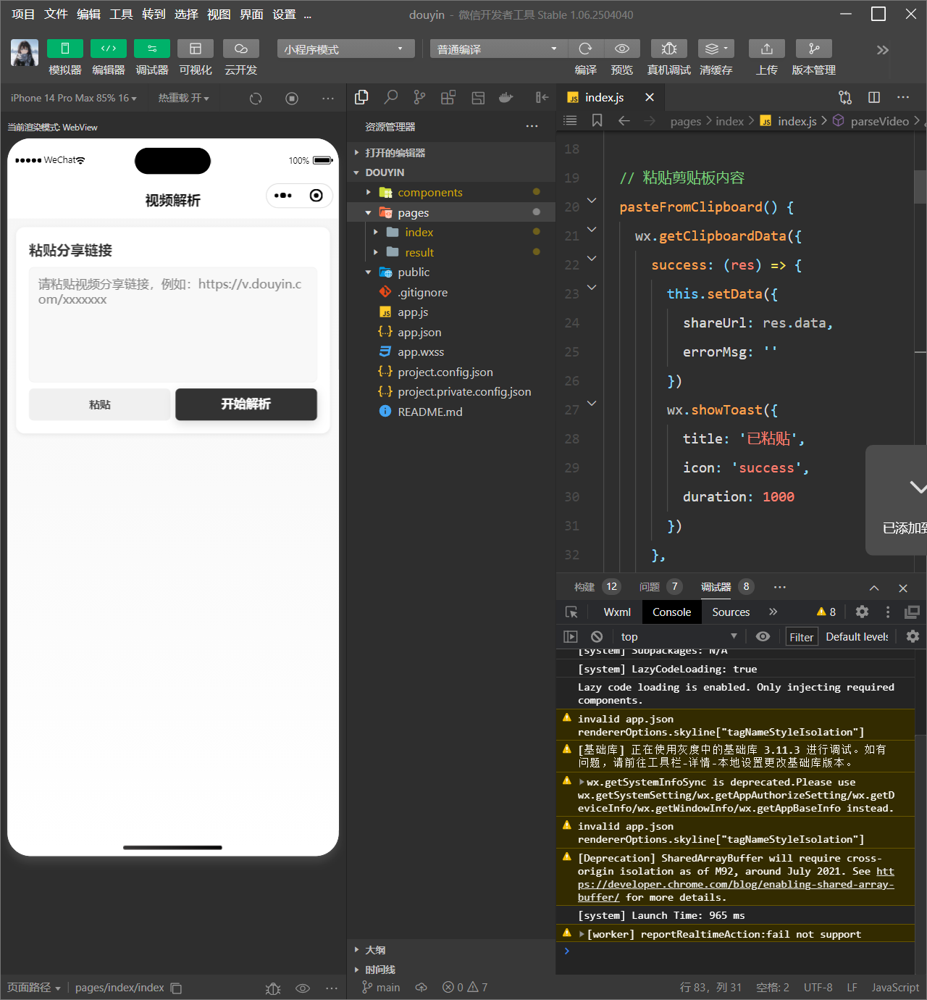

## 1in视频解析小程序

### 目录结构
- `pages/index/`：输入分享链接，发起解析
- `pages/result/`：展示解析结果，播放视频或保存封面
- `components/top-bar/`：顶部栏组件
- `app.json`：全局配置

### 预览效果图

### 二次开发须知
- 保留并标注原作者信息（如在 README 或关于页注明“原作者：1in”）。
- 扩展平台解析时，在 `pages/index/index.js` 的 `extractShareUrl` 中补充正则。
- 调整导航样式可修改 `components/top-bar`。

### 开源与商用声明
- 本项目采用 **MIT 许可证**：允许个人与商业用途、修改与再分发。
- 义务：二次开发或再发布时需保留版权声明并标注原作者信息，其余不作额外限制。
